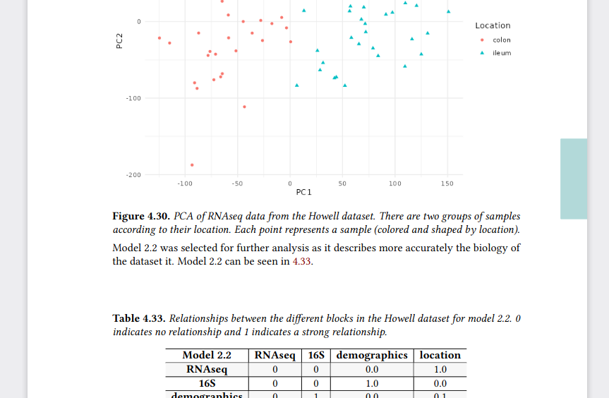

```{r setup, include = FALSE}
knitr::opts_chunk$set(collapse = TRUE, fig.retina = 2)
```

On this post I am documenting the experiences I had writing my [PhD thesis](https://thesis.llrs.dev) with bookdown.
I made the thesis in web and pdf format (and epub) to make more available the thesis.
Most of the experiences and advise I'll share here are based on my experiences to improve the pdf format.
It is the most important format as ultimately is what I'm going to use for printing.

First of all you should know there is a package [thesisdown](https://github.com/ismayc/thesisdown) with a few templates for some universities.
If yours is there, or if you want to learn how are they you can have a look at the files.\
On my case I didn't have any template and the university guidelines are not long, (have two compulsory pages at the beginning and have 5 sections).
That's why I tweaked the default format inspired by the recent thesis defended on my group.

Well, without further delay let's dive in things I learned:

-   [Captions]

-   [Chapter thumb]

-   [Placing options]

-   [Indexes](#index)

-   [Table of figures and tables]

-   [Acronyms]

-   [Placing floats]

-   [Github actions]

-   [Empty pages]

-   [Title pages]

-   [Page numbers]

-   [Include pdfs]

-   [Running titles]

-   [Merging pdfs]

-   [Reducing pdf size]

## Important

### Captions

`knitr::kable` places the captions on tables at the top (by design, see [issue #1189](https://github.com/yihui/knitr/issues/1189)), while knitr places the captions on the bottom of figures.
So if you want to have all the captions below the element you'll need to use a different package for it (`booktable`, or others).

If you want to have short captions for an easy readable table of figures and table of tables you'll need to use `kable(short.caption = "TOC", caption = "Long caption below the table").`

In addition, on `kable` if you use something like Häsler you'll need to convert this "ä" to "\\u00E4".

I also wanted to highlight and differentiate the captions.
I ended up using the `caption` package:

``` latex
\usepackage{caption}
% Set in bold the numbering of tables and chapters
\captionsetup{labelfont=bf,width=\textwidth}
```

The `\textwidh` is to make more with the captions otherwise they just spans the size of the table or figure.

### Repeating text

If you find yourself repeating some text to explain some figures, legends or tables you can use [text references](https://bookdown.org/yihui/bookdown/markdown-extensions-by-bookdown.html#text-references).

    (ref:foo) Define a text reference **here**. 

Then you can use `(ref:foo)` to repeat the same text.

Although formatting cannot be applied afterwards (i.e. `**(ref:foo)**`) it is handy to just write once and avoid repetition (And also if to keep backwards compatibility you can't use the new special comment `#|` to specify chunk options).

### Placing options

Many latex instructions go to the `index.Rmd` file.

The once I included are:

    split_by: chapter
    link-citations: true 
    always_allow_html: true
    colorlinks: yes
    # https://bookdown.org/yihui/rmarkdown-cookbook/latex-variables.html
    # links-as-notes: true # Only activate for actual printing
    fontfamily: libertine
    fontsize: 12pt
    papersize: a4 # The printed size of the thesis
    acronyms:
      loa_title: ""
      insert_loa: false
      sorting: usage
      include_unused: false
      fromfile: ./style/acronyms.yml
    geometry:
     - top=25.4mm
     - bottom=25.4mm
     - left=25.4mm
     - right=25.4mm
     - bindingoffset=6.4mm
     - asymmetric
    classoption: 
      - twoside
      - openright
    lot: yes
    lof: yes

-   `split_by` in the html format how to move to the next section.

-   `link-citations` Add a link to the citation?

-   `colorlinks` If links should have a color

-   `links-as-notes` Instead of having hyperlinks have them included as notes.
    It is useful for printing where the reader doesn't have the option to click a link but might be interested in knowing more.

-   `fontfamily` and `fontsize` decide which font and size will be used.

-   `papersize` this chooses the available space and greatly affects the position of figures and tables, which can float on the text according to LaTeX algorithm.

-   `acronyms` Configuration of the [acronyms]

-   `geometry` Defines the margins, consider that on books the central zone will not be readable.
    The `bindingoffset` adds some space to make it easier reading.

-   `classoption` Options for the book format

-   `lot` and `lof` indicate if list of tables (lot) and list of figures (lof) should be included on the pdf output.

The `book_filename` if present on index.Rmd is overwritten by what is on `_bookdown.yml` but be careful also on what goes to `_bookdown.yml` and on the specific format on `_output.yml` .

## Nice little tricks

### Dedication

Looking at the source code of the [bookdown book](https://github.com/rstudio/bookdown/blob/main/inst/examples/latex/before_body.tex) I found that the correct way was to use before_body option.

### Chapter thumb

One thing I liked from other thesis is the ability to have on the printed edition a little mark on the side of the page to find a section.

My first search showed that it [was possible](https://tex.stackexchange.com/questions/113323/how-can-one-put-a-marker-to-every-page-in-a-chapter), but I didn't want to load the `tikz` package.
I ended up using [this solution](https://tex.stackexchange.com/questions/262950/modify-chapter-thumb-for-appendix) after adding and modifying the colors, changing the size and position.

``` latex
\usepackage[scale=1,angle=0,opacity=1,contents={}]{background}
\usetikzlibrary{calc}
\usepackage{ifthen}
\usepackage{lipsum}
% auxiliary counter
\newcounter{chapshift}
% the list of colors to be used (add more if needed)
\newcommand\BoxColor{%
  \ifcase\thechapshift blue!30\or red!30\or olive!30\or magenta!30\or teal!30\or lime!30\or orange!30\or violet!30\or brown!30\else yellow!30\fi}
% the main command; the mandatory argument sets the color of the vertical box
\newcommand\ChapFrame{%
  \def\TitleText{\leftmark}%
  \AddEverypageHook{%
    \ifthenelse{\isodd{\value{page}}}
      {\backgroundsetup{
        contents={%
          \begin{tikzpicture}[overlay,remember picture]
          \node[fill=\BoxColor,inner sep=0pt,rectangle,text width=1cm,
            text height=3cm,align=center,anchor=north east]
          at ($ (current page.north east) + (-0cm,- 3*\thechapshift cm) $)
          % {\rotatebox{90}{\parbox{4cm}{%
          %   \centering\textcolor{black}{\scshape\thechapshift}}}};
          {};
          \end{tikzpicture}
        }%
      }
    }
    {\backgroundsetup{
      contents={%
        \begin{tikzpicture}[overlay,remember picture]
        \node[fill=\BoxColor,inner sep=0pt,rectangle,text width=1cm,
          text height=3cm,align=center,anchor=north west]
        at ($ (current page.north west) + (-0cm,-3*\thechapshift cm) $)
        % {\rotatebox{90}{\parbox{4cm}{%
        %   \centering\textcolor{black}{\scshape\thechapshift}}}};
        {};
        \end{tikzpicture}
      }
    }
  }
\BgMaterial}%
\stepcounter{chapshift}
}
```

This code basically means that I need to add `\ChapFrame` when I want the chapter thumb (I didn't know the name before searching this).
Once started it changes colors according to `\chapshift` which is automatically incremented by `\ChapFrame`.
I also set to change position according to `\thechapshift` so that they make a stair.

The code basically changes the position of the mark if the page is even or odd, so that it is always on the outer side of the booklet.
The size is `width=1cm, height=3cm` with text inside it.
If you want text I recommend either short titles or the chapter number `\chapter` to ensure it is readable.

A tiny trick I learned was to reset the counter with `\afterpage{\setcounter{chapshift}{0}}` after the bibliography so that the appendix would use the same mark from the beginning.
If you want different colors for the appendix you could just create a new counter and a new `\BoxColor`

### Index with index on it {#index}

I wanted to have the table of contents to show were it began, simply because with all the added page on the front and white pages it might be hard to find it.
It is also handy when using the outline of the pdf version to go back the the index to then move to another section.

Simply loading the `\tocbibind` packages was enough:

``` latex
\usepackage{tocbibind}
```


Note: I found a "bug" were the appendix link goes to the bibliography (the previous chapter) instead of the correctly displayed page.

### Table of figures and tables {#toft}

It was not required but I wanted a table of tables and a table of figures, to make it easier go to results of the thesis.
To add them I used the `tocbibind` package that automatically adds it (and the options on `index.Rmd` wasn't sure from the [answer](https://tex.stackexchange.com/a/48512/178206) I found online).

``` latex
\usepackage{tocbibind}
```


### Acronyms

I repeat many acronyms on the thesis and I wanted to have a brief table with them.
I used the [package acronymsdown](https://github.com/rchaput/acronymsdown) which is simple, easy and works well for web and pdf.\
My only wish is that it had a way to go back to were the reader was.

To place the acronyms were I wanted I had to remove the automatic title and use the following:

    # Glossary {-}

    \printacronyms

I add them to the beginning after the summaries of the thesis and the preface, right before the body of the thesis.

### Placing floats

I included many figures and tables which makes it hard to have all of them near where they are added on the text.
While it can be forced, I didn't want that but neither I wanted them too far away.

To avoid them going after the subsection I added this command before the title of the next subsection:

    \FloatBarrier

Probably it could be done automatically renewing the subsection title format, but as I only had to do this 5 times is manageable.

Following an [answer](https://stackoverflow.com/a/33801326/2886003), the figure floating algorithm was set with these preferences:

``` latex
\usepackage{float}
\usepackage{colortbl}
\let\origfigure\figure
\let\endorigfigure\endfigure
\renewenvironment{figure}[1][2] {
    \expandafter\origfigure\expandafter[!htbp]
} {
    \endorigfigure
}
```



### Github actions

To render I initially used my [r-lib/actions](htts://github.com/r-lib/actions) but without using any package structure.
However, once I set a DESCRIPTION file with all the package dependencies it was much faster, as I could use the [setup-r-dependencies](https://github.com/r-lib/actions/tree/v2/setup-r-dependencies) action.

Probably there is also a faster way directly installing binaries with the help of `bspm` or the system package manager, but this was convenient enough.

Also the action to install [tinytex](https://github.com/r-lib/actions/tree/v2/setup-tinytex) made my job for the pdf to render much faster (from 15 minutes to 5 minutes).


### Empty pages

The chapters are on the right side of the book so they must end or have a blank page before.
To have a completely blank page I [found](https://tex.stackexchange.com/a/1684/178206) a simple solution, simply load a latex package `emptypage`.

``` latex
\usepackage{emptypage}
```

### Title pages

Where to place titles, format it with `titlesec`:

``` latex
\usepackage{titlesec}
\titleformat{\chapter}[display]{\fontsize{32pt}{48pt}\bfseries\sffamily\filcenter}{
    \fontsize{72pt}{72pt} \thechapter \ChapFrame
} % Content on the chapter title page
{20pt}{\lsstyle}[\thispagestyle{empty} \cleardoublepage]% https://tex.stackexchange.com/a/347162/178206
\titleformat{name=\chapter, numberless}{\normalfont\huge\bfseries\filcenter}{}{20pt}{\Huge}
\titlespacing*{\chapter}{0pt}{100pt}{40pt}
```

The first line load the package.
Then we set the format of the chapters option display and the format of text and what appears on that page.
`\thechapter` is the title of the chapter (while `\chatper` is the number).
`\chapFrame` is the new command defined to set [chapter thumb].

The other benefit this had was that the title page had no page number.


### Page numbers

I decided to use different style for page numbers

``` latex
\usepackage[automark,headsepline]{scrlayer-scrpage}% sets page style scrheadings automatically
\clearpairofpagestyles
\ihead{\leftmark}
\ohead*{\pagemark}
\setkomafont{pagenumber}{}% default is \normalfont\normalcolor
```

### Include pdfs

As part of the appendix I added my publications on their pdf format.
To do so I used the following code modified from the [original answer](https://stackoverflow.com/questions/2739159/inserting-a-pdf-file-in-latex):

``` latex
\usepackage{pdfpages} 
\includepdf[pages=-, pagecommand={}, templatesize={\textwidth}{\textheight  - 25pt}, trim=0 0 0 20pt,]{pdf/paper.pdf}
```

I had to tweak the size were it was placed to keep the page numbers and running titles.
The last curly brackets indicate the location of the pdf to include.

The benefit of this is that these pages now are also numbered with the thesis style and the title.


### Running titles

If you have a long title such as you are probably interested on having a shorter version for it on the thesis pages.

    ## experDesign: stratifying samples into batches with minimal bias

    \sectionmark{experDesign: paper}

I don't think it actually made a big difference but it might we important for chapters.

### Merging pdfs

As I said I needed some pages at the beginning of the thesis.
But I wanted to keep the outline of the pdf, and I found an [solution online](https://stackoverflow.com/a/19358402/2886003) explaining how to do it.

To add multiple pdf I did this:

    gs -q -SDEVICE=pdfwrite -DPDFSETTINGS=/prepress -o merged.pdf page1.pdf page2.pdf thesis.pdf

### Reducing pdf size

At the end the pdf was bigger than what I could send over email.

I found [this answer](https://askubuntu.com/a/256449/270501) that helped me to reduce the size and send it.

    gs -sDEVICE=pdfwrite -dCompatibilityLevel=1.4 -dPDFSETTINGS=/ebook -dNOPAUSE -dQUIET -dBATCH -sOutputFile=output.pdf input.pdf

## Conclusion

The process of writing the thesis is usually one of the last steps on a PhD.
I recommend to write something and avoid having a blank page.
But once written you must take care of the presentation and style, this is a complete different skill than writing or research, so it can be specially exhausting.

Bookdown through the preamble and body options is great for setting your style.
But if you are short of time, are tired you might benefit from working and using some of these already created solutions and just modify what you need (as I did).

To finish, so that you can see the final format it is [here](https://thesis.llrs.dev/).
There you can download it in pdf too to see most of these commands in action.

If you are writing your thesis, enjoy, keep calm and reuse other solutions!
