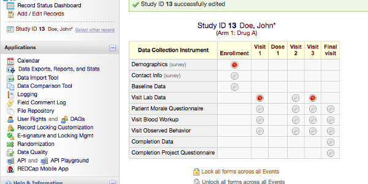

```{r setup, include = FALSE}
knitr::opts_chunk$set(collapse = TRUE, fig.retina = 2)
```

In this post, I want to summarize some of the packages to connect to [REDCap](https://www.project-redcap.org/). 
For those who don't know, REDCap is a database designed for clinical usage, which allows easy data collection of patients' responses by clinicians and interactions with the patients via surveys. 

It has specific features such as scheduling surveys sent to patients, compatibility with tablets and mobile phones for data entry while visiting patients, grouping data in instruments (for repeating the same questions multiple times), multiple choice and check buttons, and different arms (like paths for patients).
Most importantly is relatively easy to manage by clinical administrators.

In CRAN there are ~11 [packages mentioning it](https://search.r-project.org/?P=REDCap&SORT=&HITSPERPAGE=10&DB=cran-info&DEFAULTOP=and&FMT=query&xDB=all&xFILTERS=.%7E%7E) at the time of writing it.
The purpose of this post is to help decide which packages can be helpful in which situations.
This post won't be a deep analysis or comparison of capabilities, it describes some of the best and worse features of each package. 

## REDCapR

[REDCapR](https://cran.r-project.org/package=REDCapR) is the official package to connect to the database.
It allows you to read, write and filter the requests.
It has some security-related functions.

## REDCapTidieR

[REDCapTidieR](https://cran.r-project.org/package=REDCapTidieR) is a package that provides summaries of tables and helps with nested tibbles data by arm.
It depends on REDCapR.

## tidyREDCap

[tidyREDCap](https://cran.r-project.org/package=tidyREDCap) is a package that simplifies the tables for instruments and choose-all or choose-one question types.
It is easy to make tables and it depends on REDCapR.
It requires the first and last columns to make instruments.



## REDCapExporter

[REDCapExporter](https://cran.r-project.org/package=REDCapExporter) is a package to build a data package from a database for redistribution.
It does not depend on REDCapR. 

## redcapAPI

[redcapAPI](https://cran.r-project.org/package=redcapAPI) is a package for making data accessible and analysis-ready as quickly as possible with huge documentation in a wiki but has no vignette or examples and it does not depend on REDCapR. 

## REDCapDM

[REDCapDM](https://cran.r-project.org/package=REDCapDM) is a package that provides functions to read and manage REDCap data and identify missing or extreme values as well as transform the data provided by the API.
It depends on REDCapR. 

## ReviewR

[ReviewR](https://cran.r-project.org/package=ReviewR)  is a package that creates a shiny website with data from the database to explore it.
It uses the REDCapR to connect to your instance.

## rccola

[rccola](https://cran.r-project.org/package=rccola)  is a package to provide a secure connection to the database but it doesn't provide any handling of the data.
It uses redcapAPI to connect to the database.

```{r echo=FALSE, fig.caption="Number of dependencies of the packages.", fig.alt="Barplot with the dependencies: from less to more: REDCapExporter, rccola, redcapAPI, REDCapR, tidyREDCap, REDCapDM, REDCapTidieR, ReviewR"}
library("ggplot2")
pkgs <- c("REDCapR", "REDCapTidieR", "tidyREDCap", "REDCapExporter", "redcapAPI", "REDCapDM", "ReviewR", "rccola")
ap <- available.packages()
pkg_dep <- tools::package_dependencies(pkgs, db = ap, recursive = TRUE)
spkg_dep <- sort(lengths(pkg_dep))
df <- data.frame(pkg = factor(names(spkg_dep), levels = names(spkg_dep)), 
                 dep = spkg_dep)
ggplot(df) + 
  geom_col(aes(pkg, dep, fill = pkg), show.legend = FALSE) +
  theme_minimal() +
  labs(x = element_blank(), y = element_blank(), 
       title = "Dependencies of each package") +
  scale_y_continuous(expand = expansion(), sec.axis = dup_axis()) +
  theme(plot.title.position = "plot",
        plot.title = element_text(hjust = 0.5)) +
  scale_fill_viridis_d(option = "A")
```


## Other packages

Other packages mention REDCap:

- [nmadb](https://cran.r-project.org/package=nmadb): which implements its own connection procedure for a specific REDCap database of network meta-analyses.
- [distcomp](https://cran.r-project.org/package=distcomp): Allows to do computation on a distributed data also in REDCap. 
- [cgmanalysis](https://cran.r-project.org/package=cgmanalysis): which mentions that data produced is compatible with REDCap.

# Conclusion

I'm sure that many packages briefly described here can do much more than what I understood from a glance at their documentation and DESCRIPTION.

Most packages provide some data for the examples (and probably tests), while others do not.
This is a technical problem that might impact users if there are no examples in the functions. 

REDCapR is used by most packages to access the database, but most of the packages focus on transforming the data provided by the API (or data exported) or the exported data. 
It highlights that the data exported is useful but that depending on the preferences of the users it needs to be transformed for easy usage.
