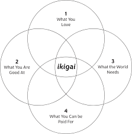

```{r setup, include = FALSE}
knitr::opts_chunk$set(collapse = TRUE, fig.retina = 2)
```

I write this post after several weeks/months of consideration of why I am feeling a burden when I contribute to the FOSS community, mostly the R community.
I want to make public some rules I set for myself for future references and in case it helps others.

# How I end up here

I use R for my work and I realized I could use it for my interests.
With the creativity of a computer language that I know well, I could answer question I had and help others in the process.

As the questions I answered were more general or more community centered I got involved in more meetings and working groups.
Some decisions/commitments were carefully considered, and known to be temporal, others were/are more open ended with an unclear end.

{width=30% height=30%}

# Current situation

1.  I often participate to the [R Contributors working group (RCWG)](https://contributor.r-project.org/working-group "RCWG webpage"), not only meetings but other activities and task.
2.  I am member of the [Bioconductor](https://bioconductor.org), helping in the forum from time to time[^1].
3.  I am member of the Bioconductor code of conduct committee.
4.  I am member of the [rOpenSci community](https://ropensci.org), helping in the slack and in the forum if the questions are related to the packages I have in their organization.
5.  I am member of the [R repository working group (RRepoWG) from the R Foundation](https://github.com/RConsortium/r-repositories-wg "RRepoWG github repository").
6.  I impulsed the Bioconductor Classes and Methods Working Group (although there isn't much activity for the last year and a half).
7.  I co-organized the local R conference of my country for 2023.
8.  I co-organized the local R user group of my city last year (2-3 events) and I've been trying to restart it this year 2024 and contributed to others RUGs.
9.  I maintain 3-4 packages on CRAN and Bioconductor[^2].

[^1]: I also receive answers and help too when I occasionally ask too.
    I also benefit of many questions from online forums (although now it is rare those I search are about R).

[^2]: There are many more only in github or some other communities.

I am sure there are several people doing more but after reflection I came to the conclusion that this is not sustainable/worth it for me.

# Reasons to keep giving

From now on when I contribute something there are 3 reasons I will keep in mind:

1.  It is part of my **work** or related to it.

    When I go to these working groups I do not represent my employer or any comunity.
    I am not paid for anything of the previous list and I need to recover the hours when I have meetings during working hours.

    Here I also include contributions to something that might make help my career.
    This includes gig jobs or consulting that I am open to do.

2.  It is **fun**ny/rewarding.

    These contributions might interest me because I find funny, for example plotting a simple tree with ggplot2.

    Or because it is rewarding helping someone to solve their problems, such as helping a family member to claim her wage for their overtime.

3.  I **learn** something.

    I don't like to learn new things for the sake of learning.
    But I enjoy learning something that could be useful: a technology, a solution, a community or new data I never analyzed.
    This might be for my personal interest or work related: recently having learn how to parse html/xml helped me at work doing a task in 5 minutes a simple task my boss would have need half an hour or more but I learned it for a hobby project.

If I see a project/proposal doesn't fit any of these three I will stop contributing/maintaining.
I'll try to avoid commitments that I think that should be done that I could step up or do it but do not fit in these three rules.
This includes contributing to books, mentoring, being the glue between different communities or simply sending a PR.

As my time is more stretched with commitments away from the keyword.
I feel torn apart between contributing more effectively or stopping.
Each hour I spend in a meeting that could/was an email is 2 hours or more that I lose, not only the opportunity cost but also the motivation[^3] and the time I spent preparing the meeting.

[^3]: Which frankly lately is very low.
    I won't get into details.

# Future contributions

Aside from that and some previous commitments I will finish serving the community.
I will no longer prioritize what is good for the community over what is good for me.
If they overlap it will be great if it doesn't, I'm sorry.

{width=30% height=30%}.

As you now know you can appeal to either of the three motivations now: Ask me something I might find funny/rewarding, ask me to learn something I could use or simply provide a payment or a way forward for my career.

I am open to consulting or developing something, you can contact me useing the [email on the blog](lluis.revilla@gmail.com){.mailito}.
