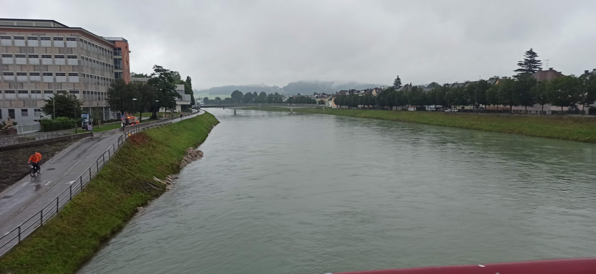
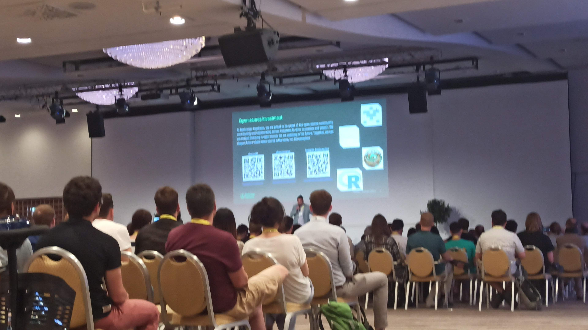
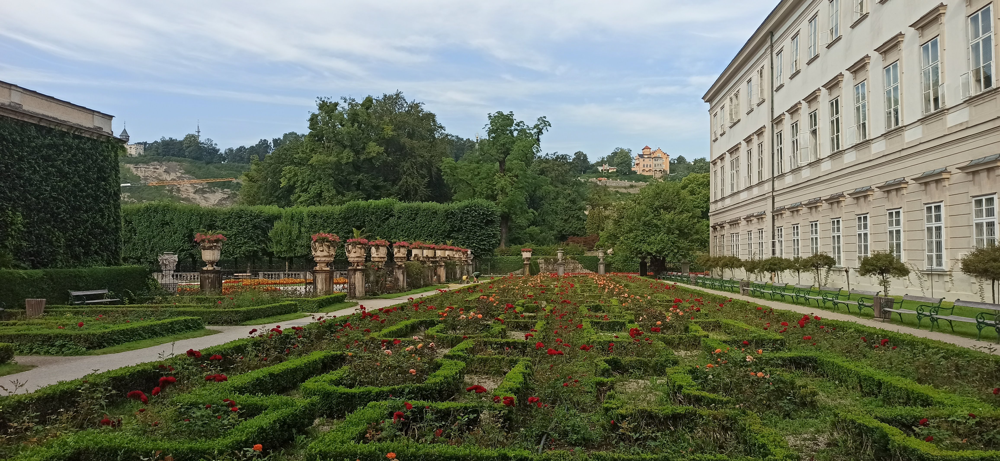
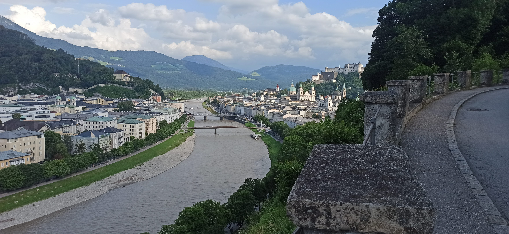
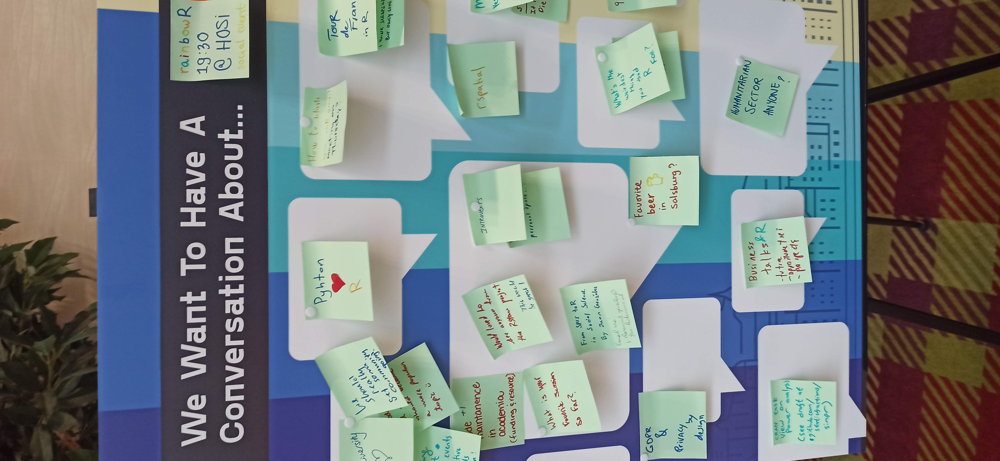
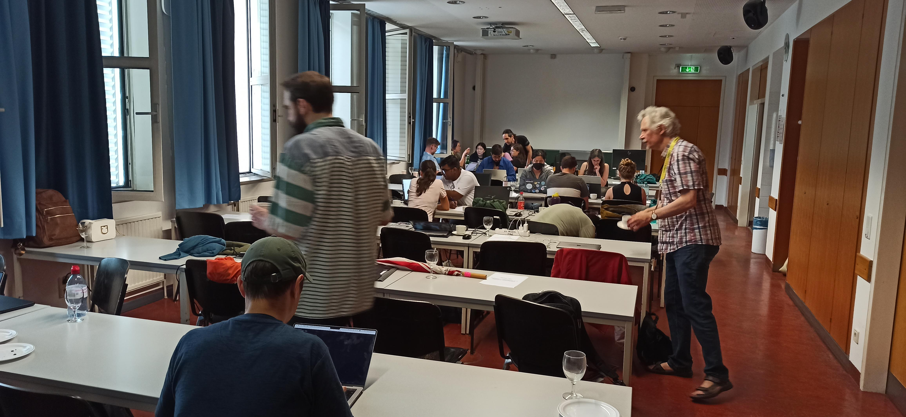

```{r setup, include = FALSE}
knitr::opts_chunk$set(collapse = TRUE, fig.retina = 2)
```

## Sunday

I was a bit down before going to Salzburg, as I was considering if spending my monthly salary in a week for useR!2
024 was worth it.
While I was looking to some talks and content I was mainly interested in meeting people.

I cherished soon, as I met with Emilio López Cano on my flight to Salzburg[^1].
Once on the flight, we met with more people going to the conference from Appsilon, a sponsor of the conference.

[^1]: He is the president of the Spanish association of R.

The day before the conference was great already: I had registered to the guided tour.
Despite the light rain, we were like 30 people in the park to visit the city with other useRs!
Lucky for me, there were people I already interacted online there too.
Shannon Pileggi and Yann Féat were in my group, which Robert Müller from Roche (another sponsor of the conference), guided as an expert through the city.
I particularly liked that he had made some notes to provide details of what he was explaining to us.
We finished the tour in a bribery drinking and eating in a relaxed environment.
Which lead to meeting Max and Fonti Kar, where their enthusiasm and their experience with R was very different from mine.



## Monday

The next day, the conference started officially.
I won't talk much about the content of the conference, as I have posted it live during the conference[^2].
But I want to write about the people I met (and those that I missed) and the environment I saw.

[^2]: I posted it on Fosstodon: [search](https://fosstodon.org/search) for `from:@Lluis_Revilla@fosstodon.org #useR2024`.

In the morning I saw several R core members there, as they took the opportunity to have a long day meeting to discuss things. 

I had registered to two tutorials: The one on the morning from Shannon about debugging R.
There I met with Maëlle Salmon for the second time, after meeting her in the previous Spanish R conference, as she was helping in the workshop.

On the afternoon I went to Gabe Becker's workshop about contributing to R, who I had meet at the R contributor working group a couple of years ago.
After it, while I was talking with him I could greet Michael Lawrence which supervised my work on the [R dev guide](https://contributor.r-project.org/rdevguide/). 

On the evening, some of us went to have dinner at the center of the city, and we end up 5 at a beer garden.



## Tuesday

On Tuesday the keynotes and the conference itself started in full swig.
We finally got our badges around our necks and prepared for the only keynote of a R core member.
Before the proper keynote there was a brief summary of the major contributions of Friedch Leisch to R and the programming world.
I knew his name was in the [Contributors' page](https://www.r-project.org/contributors.html), but didn't know much about his contributions.

After his talk I could talk with Kurt about some ongoing collaboration we have and about the data presented.
Similarly I also take the opportunity to talk with Uwe Liegges, another CRAN member, to talk about the submission process.
It struck to me the admiration he spoke of Brian Ripley's contributions to R and code in general[^3].

[^3]: But at the same time making it clear that his decisions are only his.

During the talks, I could meet Hugo Gruson, and ask him a couple of questions.
I also could greet Martin Morgan, a former R core member and ex-leader of the [Bioconductor project](https://bioconductor.org) [^4].
For those that don't know Bioconductor is also an "official" R repository focused on biology related packages [^5].

[^4]: I was surprised he was the only Bioconductor member I found at the conference.
    I expected that more people of the Bioconductor project would come here, and I saw some posters using packages shared there but no mention to the project in any talk I went.

[^5]: Official in the sense that packages in CRAN cannot have the same name as in packages in Bioconductor and *vice-versa*, and its repository can be set from R via `setRepositories()` and with environmental variable `R_BIOC_VERSION`.

During lunch with Heather Turner, which is behind the [R contributor working group](https://contributor.r-project.org/) and the R dev days (continue reading), we talked about the different background of useRs. 

In one of the previous talks I could exchange some sticker with Kelly Bodwin the last keynote of the day. 
In her keynote Kelly explained how weird R is and how her parents, both computational scientists don't like it. 
But beyond weird, R is funny and more than a programming language but about a community. 

During the day I saw several R core members talking between them.
From time to time I saw some senior attendees talking with them but rarely someone young. 

That night I had dinner with other people from the conference, and I end up meeting Hilary Parker. 



## Wednesday

On Wednesday we started with Maëlle Salmon keynote, a great talk with many references about code maintenance. 
During the conference you could find her with reading a book; she reads a lot!

After the provocative talk titled "I'm only Giving This Talk Because I'm a Woman", I had the opportunity to explain to another attendee how a Code of Conduct committee works [^6].

[^6]: My term at [Bioconductor's code of conduct committee](https://bioconductor.github.io/bioc_coc_multilingual/) is about to finish, but I served for close to 2 years.

During dinner I was sitting with Henrik Bengtsson and Charlie Gao when Martin Mächler and Luke Tierney came to sit with us.
I took the opportunity to ask how Luke ended up writing about the pipe operator, while his background and work is statistics, which lead to funny stories shared by Martin Mächler. 

On the afternoon there was also the poster session.
As I had a poster about [CRANHaven](https://cranhaven.org) I couldn't go around much, but I got to talk to lots of people that came to learn what was this about (protecting users from installing packages that. Among them came Sebastian Meyer, who I was surprised to find out that he doesn't have a permanent position as professor. 

The afternoons keynote talk from Torsten Hothorn was also inspiring about a life of work related to his package mvtnorm and how it has shaped his work, friends, family.



## Thursday

We started with a refreshingly direct and honest talk from one of the sponsors Raiffesen, about why they support R. 

Then we heard about the the effort to convert R journal articles to html webpages from Abhishek Ulayil who I had met earlier. 
His direct demo of how pdfs were converted back to dynamic html pages was funny and energizing. 

This day there were many short talks and I couldn't talk much with the presenters or many people as I was running from one site to another.

I think there were fewer R core members as many had to go back to their jobs and families. 

The last keynote of the conference was a provocative talk about Large Language Models from Hilary Parker.

The conference ended requesting participation of users to organize the next in-person conference. 

{ height=40%}

## Friday

This day was booked by the R-Dev event, this is an event where R core members hang out with interested people to fix some pending issues on R (not packages!).

It was great to see R core members sitting in the row behind me: Martin Mächler, Michael Lawrence, Tomas Kalibera, Paul Murrell, Peter Dalgaard, Luke Tierney, and Sebastian Meyer (apologies if I mix names I didn't talk to all of them, and I don't know their faces well).
Together with a mix of R users and developers like Edzer Pebesma, Paola Corrales, Fonti Kar, Mitchell O'Hara-Wild or Audrey Yeo.

There were lots of young people in the R dev and new people contributing for the first time to R. 
Some of them were a bit intimidated by submitting patches and interacting with R core members. 
However, the event ended very successfully with many patches and improvements. At the end we



# Summary

The environment of the conference was great, I spoke with many people who like me, was their first useR conference. 
There were also seasoned useRs that had been at many conferences. 
I don't know if they found this conference better or worse than previous editions but I found it it helped me to meet with people I already connected online and new people. 

I didn't take many photos with people, but I saw some people taking photos of their group, R ladies, company or selfies with other attendees (like Hadley Wickham) or online friends. 
I didn't saw many people approaching the R core members, which without them we wouldn't be there.
I must admit that I didn't know exactly how to approach them. 
I see two approaches: 1) go like a fan and ask for a selfie with them, 2) approach to them with questions or petitions about R.

I don't think neither is good but maybe there could be more collaboration with the R core.

One useR told me that the R core can't continue working as it was now that companies investing money and depending on it. 
While this is a problem for the company, I also would like to see some changes in the R core.
I am sure that with more collaboration with with them we will overcome the upcoming challenges, I hope experienced R developers that have already some rapport with the R core will step up. 

What was your experience at useR!2024? Do you agree on supporting and collaborating more the R core? We can continue the conversation at [@Lluis_Revilla@fosstodon.org](https://fosstodon.org/@Lluis_Revilla)
